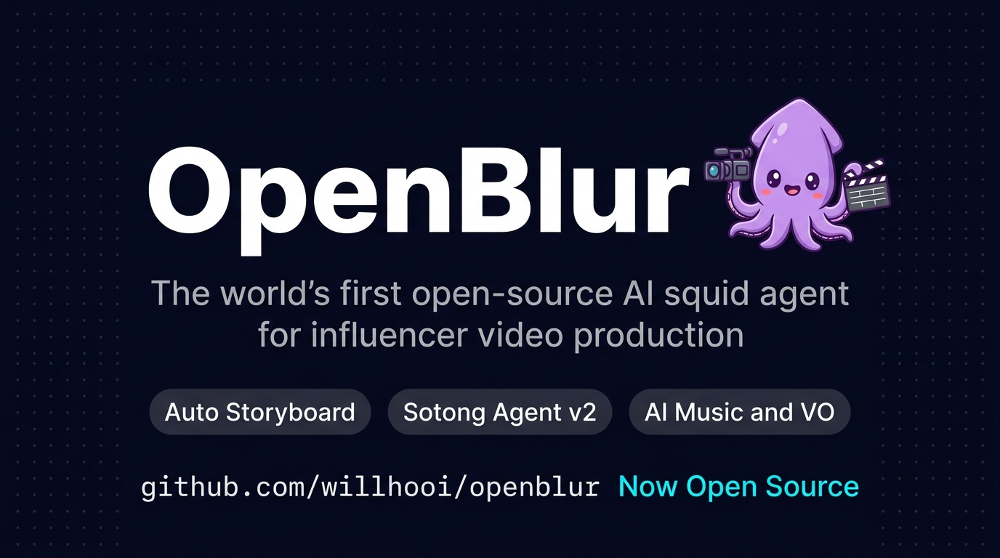
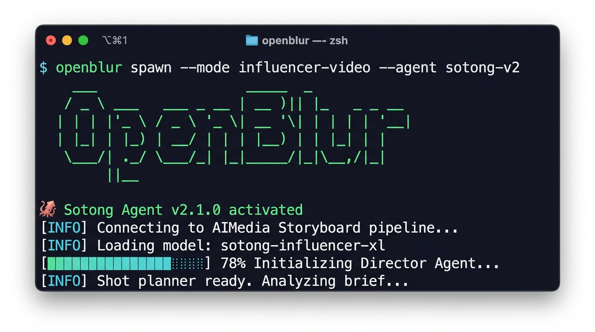
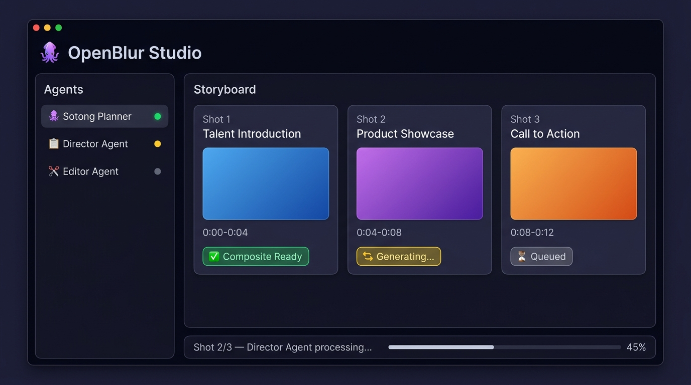
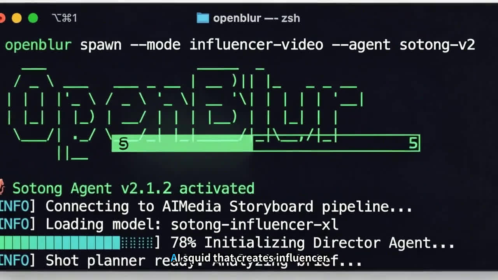
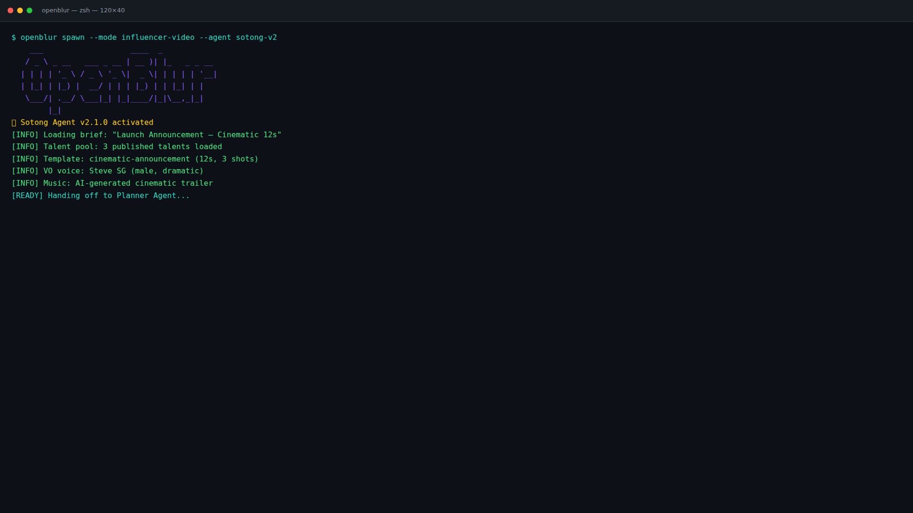
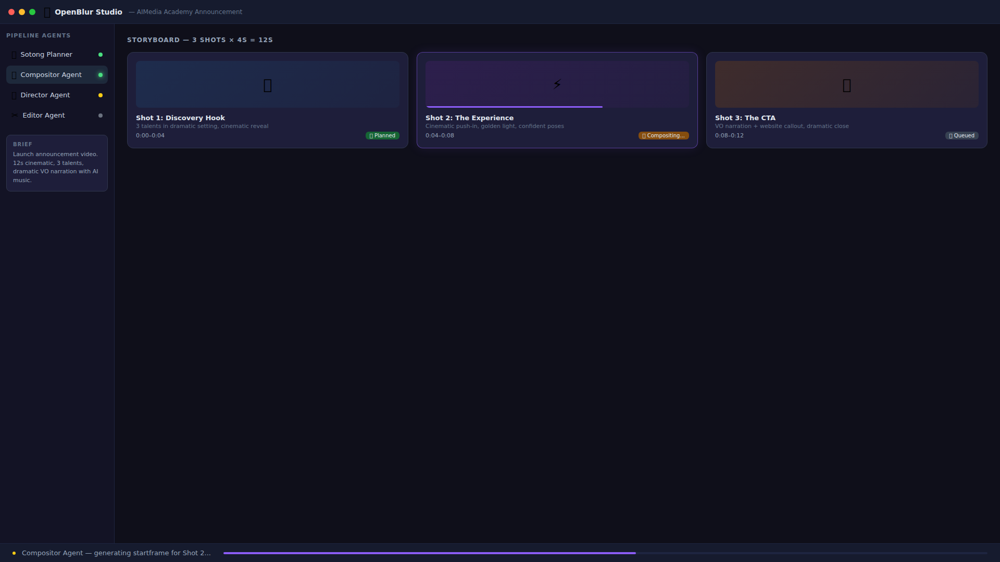
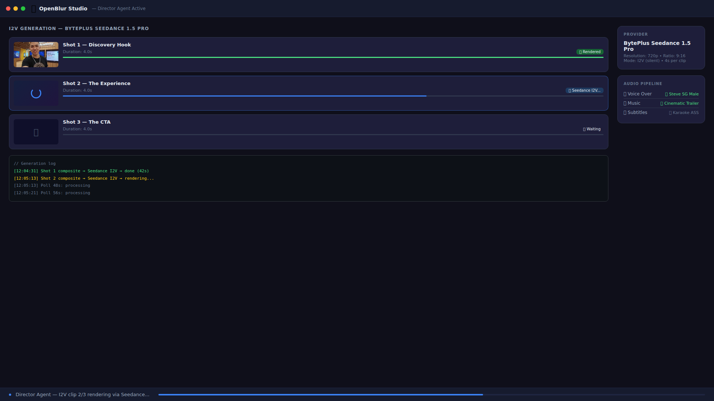
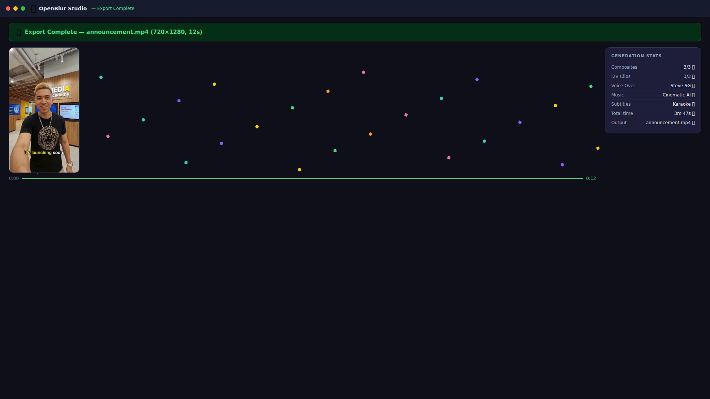

<p align="center">
  
</p>

<h1 align="center">OpenBlur</h1>

<p align="center">
  The world's first open-source AI squid agent for influencer video production.
</p>

<p align="center">
  <a href="#features">Features</a> &middot;
  <a href="#quick-start">Quick Start</a> &middot;
  <a href="#how-it-was-built">How It Was Built</a> &middot;
  <a href="#architecture">Architecture</a> &middot;
  <a href="#screenshots">Screenshots</a> &middot;
  <a href="#examples">Examples</a>
</p>

---

## What is OpenBlur?

OpenBlur is an AI agent that creates influencer-style videos from a single text brief. You spawn the **Sotong Agent**, give it a brief, and it handles everything — storyboarding, composite generation, video rendering, voiceover, music, and subtitle burning.

Built with [Remotion](https://remotion.dev) for pixel-perfect programmatic video, with an agentic pipeline that orchestrates multiple AI providers.

## Features

- **Auto Storyboard** — AI plans shots, timing, and transitions from a text brief
- **Composite Generation** — Multi-reference image compositing via Gemini
- **Image-to-Video** — Animated clips from static composites (pluggable I2V providers)
- **AI Voiceover** — Natural narration with word-level timestamp sync
- **AI Music** — Background music generated from mood/genre prompts
- **Karaoke Subtitles** — Word-synced ASS subtitles with customizable styles
- **Remotion Rendering** — Pixel-perfect React-to-video with CSS animations
- **Multi-provider Fallback** — Graceful degradation across AI providers

## Quick Start

```bash
git clone https://github.com/willhooi/openblur.git
cd openblur
npm install

# Preview in browser
npx remotion studio src/index.tsx

# Render video
npx remotion render src/index.tsx OpenBlur output.mp4

# Render a single screenshot
npx remotion still src/index.tsx Terminal screenshot.png --frame 80
```

---

## How It Was Built

This project went through three iterations in a single session. Each failure taught us something about where AI generation works and where it doesn't.

### Attempt 1: AI-Generated Screenshots + I2V Video

The first idea was straightforward — use **Gemini 3.1 Flash** to generate fake desktop screenshots from text prompts, then animate them with **Seedance 1.5 Pro** (image-to-video).

**Gemini generated the screenshots.** The layouts were impressive — dark themed terminals, sidebar panels, shot cards. But zoom in and the text was subtly garbled. Characters were approximate. No two generations produced the same layout.

<p align="center">
  
  
</p>
<p align="center"><em>Gemini T2I screenshots — convincing at a glance, but text is imprecise on closer look</em></p>

**Then Seedance tried to animate them.** This is where it fell apart. I2V models treat every pixel as something to animate — they have no concept of "this is a UI element that should stay still." The text warped, progress bars wobbled, and the clean terminal became a melting mess.

<p align="center">
  
</p>
<p align="center"><em>A frame from the Seedance I2V output — text warping and UI distortion</em></p>

The [original I2V video](docs/evolution/seedance-i2v-video.mp4) is in the repo if you want to see the full distortion in motion.

### Attempt 2: Remotion for Video, Gemini for Stills

We kept the Gemini screenshots for social media (static images were fine) but replaced I2V with **Remotion** — rendering the same screens as React components with CSS animations. This worked, but maintaining two separate representations of the same UI was redundant.

### Attempt 3: Full Remotion (Final)

Everything became React. The same components produce both the video frames and the static screenshots via `remotion still`. One source of truth.

Each screen is a React component with `useCurrentFrame()` driving the animations:
- **Typing effects** — frame-delayed line reveals with blinking cursor
- **Progress bars** — `interpolate(frame, [start, end], [0%, 100%])`
- **Card entries** — `spring()` for physics-based scale animations
- **Confetti** — particle position calculated from frame offset
- **Embedded video** — `<OffthreadVideo>` plays the actual output video inside the UI

```bash
# Same components, two outputs
npx remotion render src/index.tsx OpenBlur video.mp4        # → animated video
npx remotion still src/index.tsx Planning screenshot.png     # → static frame
```

### What We Learned

| | AI Generation (Gemini + Seedance) | Programmatic (Remotion) |
|---|---|---|
| **Text** | Approximate, sometimes garbled | Pixel-perfect, actual fonts |
| **Consistency** | Different every generation | Deterministic, identical every time |
| **Animation** | I2V distorts static elements | CSS transitions, physics springs |
| **Cost** | ~$2-3 per generation | Free (local render) |
| **Render time** | ~4 min (API polling) | ~60s (local) |
| **Customization** | Re-prompt and hope | Edit props, re-render |

**The lesson:** Use AI where it's strong — voice (ElevenLabs), music (MusicGen), image compositing (Gemini). But for anything with text or UI, render it deterministically. Don't ask a diffusion model to be a browser.

> For the full technical breakdown with pipeline diagrams, see [docs/EVOLUTION.md](docs/EVOLUTION.md).

---

## Architecture

```
Brief (text)
  │
  ├─ 🦑 Sotong Planner Agent
  │    └─ Shot planning, template selection, VO script
  │
  ├─ 🎨 Compositor Agent
  │    └─ Gemini / Nano Banana 2 composite generation
  │
  ├─ 📋 Director Agent
  │    └─ I2V clip generation (pluggable provider)
  │
  ├─ 🎙️ Audio Pipeline
  │    ├─ ElevenLabs TTS (word-level timestamps)
  │    └─ MusicGen background music
  │
  └─ ✂️ Editor Agent
       ├─ Remotion React composition
       ├─ ASS karaoke subtitle generation
       └─ FFmpeg audio mixing + export
```

### Final Pipeline

```
ElevenLabs VO (with-timestamps) → probe audio duration
                                        ↓
              Remotion render (duration = VO length + buffer)
              Remotion stills (screenshots at key frames)
              MusicGen background music
                          ↓
              FFmpeg: ASS subtitles (synced to word timestamps)
                    + VO audio (boosted 120%)
                    + music (-10dB)
                    → final.mp4
```

The video duration adapts to the voiceover — Remotion renders exactly enough frames for the narration to finish naturally, plus a few seconds of buffer for the closing screen.

## Screenshots

All rendered from the same React components via `remotion still`:

<p align="center">
  
  
</p>
<p align="center">
  
  
</p>

## Remotion Compositions

The [`src/components/`](src/components/) directory contains the React components that render each screen:

| Composition | Description | Screenshot |
|---|---|---|
| [`TerminalScreen`](src/components/TerminalScreen.tsx) | CLI spawn animation with typing effect, progress bars | [View](screenshots/terminal.png) |
| [`PlanningScreen`](src/components/PlanningScreen.tsx) | Storyboard UI with shot cards, agent status sidebar | [View](screenshots/planning.png) |
| [`GenerationScreen`](src/components/GenerationScreen.tsx) | I2V rendering progress with clip queue and stats | [View](screenshots/generation.png) |
| [`OutputScreen`](src/components/OutputScreen.tsx) | Export complete with embedded video preview | [View](screenshots/output.png) |
| [`HeroScreen`](src/components/HeroScreen.tsx) | Brand reveal with mascot | [View](screenshots/hero.png) |

The main [`Composition.tsx`](src/components/Composition.tsx) distributes all 5 screens across the video duration with 1-second crossfades. Pass any frame count and the timing adapts automatically.

## Examples

The [`examples/`](examples/) directory contains reference implementations for the audio pipeline:

| File | What it does |
|---|---|
| [`tts-with-timestamps.ts`](examples/tts-with-timestamps.ts) | ElevenLabs TTS with word-level alignment for subtitle sync |
| [`karaoke-subtitles.ts`](examples/karaoke-subtitles.ts) | ASS subtitle generator with `\kf` karaoke sweep — from real timestamps or estimated |
| [`music-gen.ts`](examples/music-gen.ts) | Replicate MusicGen background music from text prompts |
| [`ffmpeg-mix.sh`](examples/ffmpeg-mix.sh) | One-liner: burn subtitles + mix VO + music onto Remotion video |

### Render commands

```bash
# Full video
npx remotion render src/index.tsx OpenBlur demo.mp4 --codec h264 --crf 18

# Custom duration (composition adapts to any frame count)
npx remotion render src/index.tsx OpenBlur demo.mp4 --frames 0-599   # 20s
npx remotion render src/index.tsx OpenBlur demo.mp4 --frames 0-1349  # 45s

# All screenshots
npm run screenshots
```

## Tech Stack

- [Remotion](https://remotion.dev) — React-based programmatic video
- [ElevenLabs](https://elevenlabs.io) — TTS with word-level alignment
- [Replicate MusicGen](https://replicate.com) — AI background music
- [FFmpeg](https://ffmpeg.org) — Audio mixing + subtitle burning
- TypeScript / React

## License

MIT

---

<p align="center">
  <br/>
  <strong>⚠️ Disclaimer</strong><br/>
  This is an April Fools 2026 project. A lousy attempt at a prank, but hey — the code is real and it actually works.<br/>
  No sotongs were harmed in the making of this repo. 🦑
</p>
