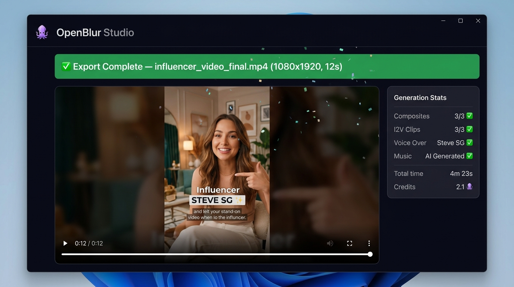
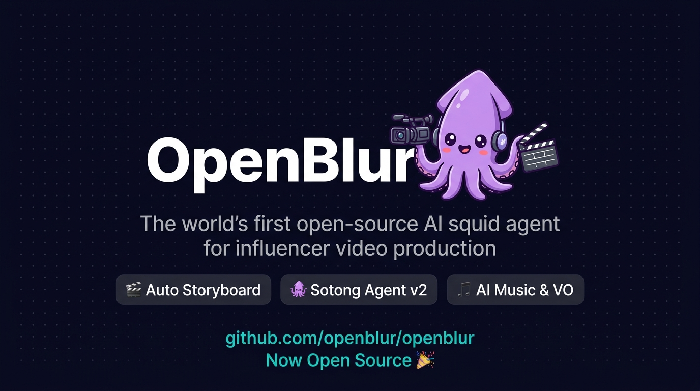

# Evolution: From AI-Generated Screenshots to Remotion

A case study on how we went from AI-generated screenshots + I2V video to pixel-perfect HTML/CSS rendering. The journey through three approaches, what failed, and why Remotion was the answer.

---

## The Brief

Create a fake product demo video showing "OpenBlur Studio" — a desktop app UI with terminal, planning screens, generation progress, and export views. The video needed crisp text, realistic UI elements, and smooth transitions.

## Approach 1: Gemini T2I Screenshots + Seedance I2V

**Idea:** Use Google Gemini 3.1 Flash to generate fake desktop screenshots from text prompts, then animate them with BytePlus Seedance 1.5 Pro (image-to-video).

### The Gemini Screenshots

We prompted Gemini with detailed UI descriptions — terminal layouts, sidebar panels, shot cards, progress bars. The results were visually impressive at first glance:

<p align="center">
  
  
</p>
<p align="center">
  
  
</p>

**What worked:**
- Overall layout and composition looked convincing
- Color schemes and dark theme were on point
- Gemini understood UI concepts (sidebars, cards, progress bars)

**What didn't:**
- Text was subtly wrong — garbled characters, inconsistent fonts
- Progress bars and status indicators looked "painted" rather than rendered
- No two generations were consistent — regenerating gave different layouts
- Small UI details (traffic light buttons, status dots) were imprecise

### The I2V Disaster

Then we fed these screenshots into Seedance 1.5 Pro for image-to-video. The idea was to get subtle "screen recording" motion — cursor movement, progress bars advancing.

<p align="center">
  
  <br/>
  <em>A frame from the Seedance I2V output — notice the text warping and UI element distortion</em>
</p>

**What happened:**
- Seedance treats every pixel as something to animate — it warped the text
- UI elements morphed and shifted unnaturally
- Progress bars wobbled instead of advancing smoothly
- The crisp terminal text became a blurry, melting mess
- Even with `--camerafixed true`, the model still distorted static elements

**Root cause:** I2V models are designed to animate natural scenes (people, landscapes, products). They have no concept of "this is a UI element that should stay pixel-perfect." Every frame is a new generation, so text and geometric shapes drift.

### Pipeline (Approach 1)

```
Gemini T2I (4 screenshots) → S3 upload → BytePlus Seedance I2V (3 × 4s clips)
→ FFmpeg xfade stitch → ElevenLabs VO → MusicGen → FFmpeg final mix
```

**Cost:** 4 Gemini API calls + 3 Seedance I2V calls (~$2-3 total)
**Time:** ~4 minutes (mostly I2V polling)
**Quality:** Text distortion made it unusable for a convincing UI demo

---

## Approach 2: Gemini Screenshots (static) + Remotion (video)

**Idea:** Keep the Gemini screenshots for social media posts (static images are fine), but replace I2V with Remotion for the video — render the same UI screens as React components with CSS animations.

This was a hybrid — Gemini for stills, Remotion for video. It worked, but maintaining two separate representations of the same screens was redundant.

---

## Approach 3: Full Remotion (final)

**Idea:** Build everything in React. Use Remotion for both the video AND the screenshots (via `remotion still`). One source of truth.

### The React Components

Each screen became a React component with inline styles:

- **TerminalScreen** — Typing animation via frame-delayed line reveals, blinking cursor, animated progress bar
- **PlanningScreen** — Shot cards with `spring()` entry animations, status dots, sidebar with agent states
- **GenerationScreen** — Clip queue with spinning loaders, live log with frame-gated lines
- **OutputScreen** — Embedded `<OffthreadVideo>` playing the actual output, confetti particles, stats panel
- **HeroScreen** — Brand image with `spring()` zoom-in

### Screenshots from Video Components

```bash
# Same components, just frozen at the best frame
npx remotion still src/index.tsx Terminal screenshot.png --frame 80
npx remotion still src/index.tsx Planning screenshot.png --frame 100
```

**Compare — Gemini (left) vs Remotion (right):**

| | Gemini T2I | Remotion HTML/CSS |
|---|---|---|
| Text fidelity | Approximate, sometimes garbled | Pixel-perfect, actual fonts |
| Consistency | Different every generation | Deterministic, identical every time |
| Animations | N/A (static) or I2V distortion | CSS transitions, `spring()`, `interpolate()` |
| Customization | Re-prompt and hope | Edit React props and re-render |
| Render time | ~10s per image + ~90s per I2V clip | ~30s for full 30s video |

### Pipeline (Final)

```
ElevenLabs VO (with timestamps) → probe duration
                                      ↓
Remotion render (duration = VO length + 3s buffer)  ←  React components
Remotion stills (5 screenshots at key frames)           with CSS animations
MusicGen background music
                    ↓
FFmpeg: burn ASS subtitles (synced to real word timestamps)
      + mix VO (120% volume) + music (-10dB)
      → final.mp4
```

**Cost:** ElevenLabs TTS (~$0.10) + MusicGen (~$0.05) + zero for Remotion (local render)
**Time:** ~60-90 seconds total
**Quality:** Pixel-perfect text, smooth CSS animations, deterministic output

---

## Key Lessons

1. **AI image generators aren't designed for UI screenshots.** They approximate visual patterns but can't guarantee pixel-level text accuracy. Fine for hero graphics and illustrations, bad for anything with readable text.

2. **I2V models destroy static elements.** If your source image has text, geometric shapes, or UI components, I2V will distort them. These models are optimized for natural motion, not screen recordings.

3. **Remotion is the right tool for programmatic video.** If you know what the frames should look like, don't generate them — render them. React + CSS gives you deterministic, pixel-perfect results with actual animations.

4. **Use AI where it's strong.** In our final pipeline, AI handles what it's good at: voice (ElevenLabs), music (MusicGen), and subtitle timing. The visual rendering stays in the deterministic domain (React/Remotion).

5. **One source of truth matters.** Having the same React components produce both the video frames and the static screenshots eliminates inconsistency between your marketing materials and your demo.

---

*This evolution happened over a single session. The Gemini screenshots and I2V video artifacts are preserved in `docs/evolution/` for reference.*
